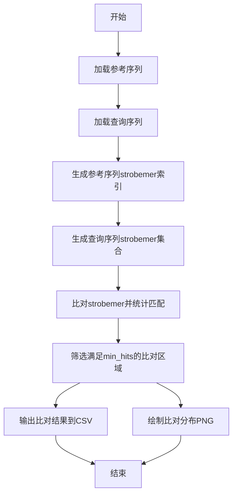

# strobealign-project 项目报告

---
## 作者：刘正涛（小组11）

[toc]


## 一、项目简介

本项目实现了基于 strobemer 的 DNA 序列比对工具。通过生成 strobemer 索引，实现对参考序列和查询序列的高效比对，并支持结果的可视化和导出。

---
本项目已上传至github，链接为 https://github.com/5112369/final_project
## 二、项目结构

```
strobealign-project/
├── src/
│   ├── strobealign.py              # 主算法与工具函数
│   └── utils.py                    # 辅助工具
├── tests/
│   └── test_strobealign.py         # 单元测试与可视化
├── data/
│   ├── ref.fa                      # 参考序列（FASTA格式）
│   └── query.fa                    # 查询序列（FASTA格式）
├── results/                        # 输出结果文件夹（可选，存放csv/png等）
├── 项目报告.md                     # 项目完整报告文档
├── README.md                       # 简要说明
├── requirements.txt                # Python 环境依赖
└── .venv/                          # 虚拟环境（可选）
```

**说明：**
- `src/`：存放主程序代码，包括比对算法和工具函数。
- `tests/`：存放测试代码，包含自动化测试和结果可视化。
- `data/`：存放输入的参考序列和查询序列（FASTA格式）。
- `results/`：存放每次运行生成的csv和png等输出文件（可选）。
- `项目报告.md`：详细项目报告。
- `README.md`：简要项目说明和使用方法。
- `requirements.txt`：项目依赖库列表。
- `.venv/`：Python虚拟环境目录（建议使用）。

你可以在VS Code或命令行下直接运行和管理本项目。
## 三、核心算法流程

### 1. 主要流程伪代码

```plaintext
输入：参考序列(ref.fa)、查询序列(query.fa)、参数(k, w_min, w_max, n, min_hits)
输出：比对结果CSV、比对分布PNG

1. 加载参考序列和查询序列（FASTA格式）
2. 生成参考序列的strobemer索引
3. 生成查询序列的strobemer集合
4. 遍历查询strobemer，查找在参考索引中的匹配
5. 统计所有匹配的偏移量，筛选出满足min_hits的比对区域
6. 输出所有比对结果到CSV文件
save_alignments_to_csv 伪代码：
输入：alignments（比对结果列表），filename（输出文件名）
a. 打开CSV文件
b. 写入表头
c. 遍历alignments，每行写入一组比对结果
7. 绘制比对起点分布直方图并保存为PNG
plot_alignment_distribution 伪代码：
输入：alignments（比对结果列表），filename（图片名）
a. 如果alignments为空，提示并返回
b. 提取所有比对的参考序列起点
c. 绘制直方图
d. 计算最大值、均值、最小/最大起点等
e. 在图上添加详细批注
f. 保存图片并显示

```

---

### 2. 详细伪代码

# 主函数：使用strobemer进行序列比对
函数 strobealign(query_sequence, reference_sequence, k, w_min, w_max, n, min_hits):
    # 步骤1：为参考序列构建strobemer索引
    ref_index = 构建参考序列索引(reference_sequence, k, w_min, w_max, n)
    
    # 步骤2：从查询序列生成所有strobemer
    query_strobemers = 生成查询序列的strobemer(query_sequence, k, w_min, w_max, n)
    
    # 步骤3：初始化匹配结果的哈希表（按偏移量分组）
    matches = 空哈希表  # 键：偏移量offset，值：匹配位置列表
    
    # 步骤4：遍历查询序列的每个strobemer
    对于 query_strobemers 中的每一个 (q_pos, q_strobemer):
        # 检查当前strobemer是否存在于参考序列索引中
        如果 ref_index 中存在键 q_strobemer:
            # 遍历参考序列中所有匹配该strobemer的位置
            对于 ref_index[q_strobemer] 中的每一个 r_pos:
                # 计算参考序列和查询序列的位置偏移量
                offset = r_pos[0] - q_pos[0]  # 第一个子串的位置差
                # 将匹配位置添加到对应偏移量的分组中
                matches[offset].追加( (r_pos, q_pos) )
    
    # 步骤5：筛选有效的匹配区域
    results = 空列表
    对于 matches 中的每一个 (offset, hit_list):
        # 检查当前偏移量的匹配数是否达到阈值
        如果 hit_list 的长度 >= min_hits:
            # 计算参考序列的匹配区间起始和结束
            r_start = 取 hit_list 中所有 r_pos[0][0] 的最小值  # 所有参考子串的最左起始
            r_end = 取 hit_list 中所有 (r_pos[0][-1] + k) 的最大值  # 最右结束（考虑k-mer长度）
            
            # 计算查询序列的匹配区间起始和结束
            q_start = 取 hit_list 中所有 q_pos[0][0] 的最小值
            q_end = 取 hit_list 中所有 (q_pos[0][-1] + k) 的最大值
            
            # 计算实际匹配长度（取参考和查询的最小重叠）
            match_length = 最小值(r_end - r_start, q_end - q_start)
            
            # 将结果保存为元组（参考起始，查询起始，匹配长度）
            results.追加( (r_start, q_start, match_length) )
    
    # 步骤6：按匹配长度降序排序结果
    results.排序(依据=lambda x: -x[2])
    
    # 返回比对结果
    返回 results


# 子函数1：构建参考序列的strobemer索引
函数 构建参考序列索引(reference_sequence, k, w_min, w_max, n):
    ref_index = 空哈希表  # 键：strobemer，值：位置列表
    # 生成参考序列的所有strobemer
    reference_strobemers = 生成strobemer(reference_sequence, k, w_min, w_max, n)
    # 将strobemer和位置存入索引
    对于 reference_strobemers 中的每一个 (r_pos, r_strobemer):
        如果 r_strobemer 不在 ref_index 中:
            ref_index[r_strobemer] = 空列表
        ref_index[r_strobemer].追加(r_pos)
    返回 ref_index


# 子函数2：生成strobemer（通用函数）
函数 生成strobemer(sequence, k, w_min, w_max, n):
    strobemers = 空列表
    # 遍历序列中所有可能的起始位置
    对于 i 从 0 到 (sequence长度 - n*k - 1):
        # 生成n个相邻的k-mer（每个间隔在[w_min, w_max]内）
        strobe = 空列表
        positions = 空列表
        对于 j 从 0 到 n-1:
            start = i + j*(k + w_min)  # 动态计算子串起始位置
            如果 start + k > sequence长度:
                跳出循环
            sub_kmer = sequence[start : start + k]
            strobe.追加(sub_kmer)
            positions.追加( (start, start + k - 1) )  # 记录子串的起止位置
        # 合并为一个strobemer（如拼接子k-mer）
        如果 strobe 的长度 == n:
            strobemers.追加( (positions, 连接(strobe)) )  # 保存位置和拼接后的字符串
    返回 strobemers

---

## 四、项目流程图



---

## 五、主要模块说明

- **load_fasta**：加载FASTA格式序列
- **generate_strobemers**：生成strobemer集合
- **build_index**：构建参考序列strobemer索引
- **strobealign**：主比对流程
- **save_alignments_to_csv**：保存比对结果
- **plot_alignment_distribution**：可视化比对分布

---

## 六、结果展示

- 每次运行会生成带时间戳的CSV和PNG文件，文件名中包含输入数据名，便于溯源和管理。

- PNG图片包含详细批注，直观展示比对分布特征。

---

## 七、总结

本项目适合生信初学者理解strobemer思想和比对流程，代码结构清晰，易于扩展和二次开发。