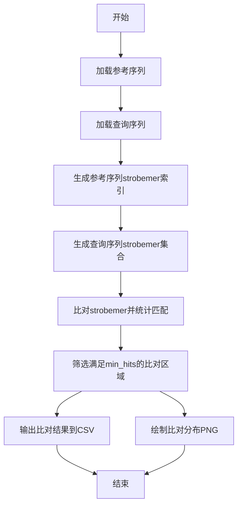

# strobealign-project 项目报告

---
## 作者：刘正涛（小组11）

[toc]


## 一、项目简介

本项目实现了基于 strobemer 的 DNA 序列比对工具。通过生成 strobemer 索引，实现对参考序列和查询序列的高效比对，并支持结果的可视化和导出。

---
本项目已上传至github，链接为
## 二、项目结构

```
strobealign-project/
├── src/
│   ├── strobealign.py              # 主算法与工具函数
│   └── utils.py                    # 辅助工具
├── tests/
│   └── test_strobealign.py         # 单元测试与可视化
├── data/
│   ├── ref.fa                      # 参考序列（FASTA格式）
│   └── query.fa                    # 查询序列（FASTA格式）
├── results/                        # 输出结果文件夹（可选，存放csv/png等）
├── 项目报告.md                     # 项目完整报告文档
├── README.md                       # 简要说明
├── requirements.txt                # Python 环境依赖
└── .venv/                          # 虚拟环境（可选）
```

**说明：**
- `src/`：存放主程序代码，包括比对算法和工具函数。
- `tests/`：存放测试代码，包含自动化测试和结果可视化。
- `data/`：存放输入的参考序列和查询序列（FASTA格式）。
- `results/`：存放每次运行生成的csv和png等输出文件（可选）。
- `项目报告.md`：详细项目报告。
- `README.md`：简要项目说明和使用方法。
- `requirements.txt`：项目依赖库列表。
- `.venv/`：Python虚拟环境目录（建议使用）。

你可以在VS Code或命令行下直接运行和管理本项目。
## 三、核心算法流程

### 1. 主要流程伪代码

```plaintext
输入：参考序列(ref.fa)、查询序列(query.fa)、参数(k, w_min, w_max, n, min_hits)
输出：比对结果CSV、比对分布PNG

1. 加载参考序列和查询序列（FASTA格式）


2. 生成参考序列的strobemer索引
3. 生成查询序列的strobemer集合
4. 遍历查询strobemer，查找在参考索引中的匹配
5. 统计所有匹配的偏移量，筛选出满足min_hits的比对区域

6. 输出所有比对结果到CSV文件
save_alignments_to_csv 伪代码：
输入：alignments（比对结果列表），filename（输出文件名）
1. 打开CSV文件
2. 写入表头
3. 遍历alignments，每行写入一组比对结果

7. 绘制比对起点分布直方图并保存为PNG
plot_alignment_distribution 伪代码：
输入：alignments（比对结果列表），filename（图片名）
1. 如果alignments为空，提示并返回
2. 提取所有比对的参考序列起点
3. 绘制直方图
4. 计算最大值、均值、最小/最大起点等
5. 在图上添加详细批注
6. 保存图片并显示

```

---

### 2. 详细伪代码

```plaintext
函数 strobealign(query, reference, k, w_min, w_max, n, min_hits):
    ref_index = build_index(reference, k, w_min, w_max, n)
    query_strobemers = generate_strobemers(query, k, w_min, w_max, n)
    matches = defaultdict(list)
    for q_pos, q_strobemer in query_strobemers:
        if q_strobemer in ref_index:
            for r_pos in ref_index[q_strobemer]:
                offset = r_pos[0] - q_pos[0]
                matches[offset].append((r_pos, q_pos))
    results = []
    for offset, hit_list in matches.items():
        if len(hit_list) >= min_hits:
            r_start = min([pos[0][0] for pos in hit_list])
            q_start = min([pos[1][0] for pos in hit_list])
            r_end = max([pos[0][-1] + k for pos in hit_list])
            q_end = max([pos[1][-1] + k for pos in hit_list])
            match_length = min(r_end - r_start, q_end - q_start)
            results.append((r_start, q_start, match_length))
    results.sort(key=lambda x: -x[2])
    return results
```

---

## 四、项目流程图



---

## 五、主要模块说明

- **load_fasta**：加载FASTA格式序列
- **generate_strobemers**：生成strobemer集合
- **build_index**：构建参考序列strobemer索引
- **strobealign**：主比对流程
- **save_alignments_to_csv**：保存比对结果
- **plot_alignment_distribution**：可视化比对分布

---

## 六、结果展示

- 每次运行会生成带时间戳的CSV和PNG文件，文件名中包含输入数据名，便于溯源和管理。

- PNG图片包含详细中文批注，直观展示比对分布特征。

---

## 七、总结

本项目适合生信初学者理解strobemer思想和比对流程，代码结构清晰，易于扩展和二次开发。